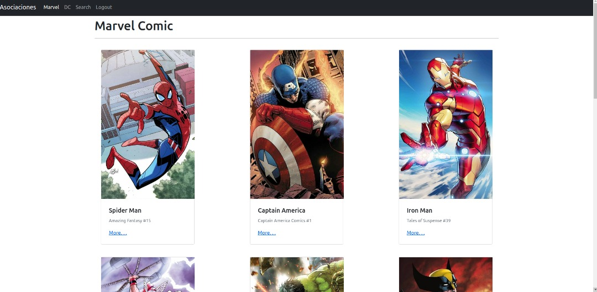

# Hero App

Es un proyecto donde se utiliza React.js, Testing, Hooks
entre otras cosas.

 

Se pueden buscar por nombre una lista de gif.

## Instrucciones:

- Clonas o descargas el repositorio.

- Haces un npm install

- Ejecutas yarn start

¡Y esta listo! Espero les guste y que tengan un lindo día.

##### Getting Started with Create React App

Este proyecto fué creado con [Create React App](https://github.com/facebook/create-react-app).
